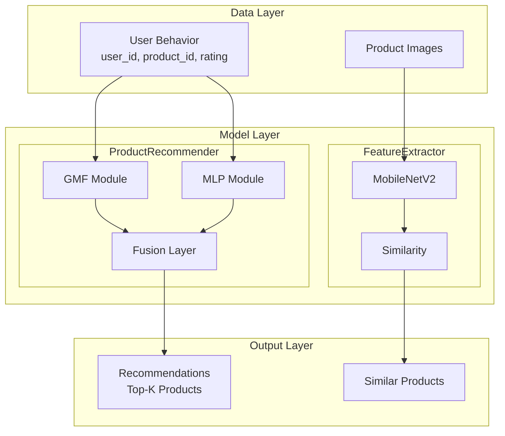

# TensorFlow 商品推荐系统

基于神经协同过滤 (Neural Collaborative Filtering) 的商品推荐系统，使用 TensorFlow/Keras 实现。

## 系统架构



### 架构说明

| 层级 | 组件 | 功能 |
|------|------|------|
| 数据层 | 用户行为数据 | 用户ID、商品ID、评分 |
| 数据层 | 商品图像数据 | 商品图片文件 |
| 模型层 | GMF 模块 | 广义矩阵分解，学习用户-商品潜在因子 |
| 模型层 | MLP 模块 | 多层感知器，学习非线性交互 |
| 模型层 | 融合层 | 整合 GMF 和 MLP 输出 |
| 模型层 | MobileNetV2 | 轻量级 CNN，提取图像特征 |
| 模型层 | 相似度计算 | 基于余弦相似度匹配 |
| 输出层 | 推荐结果 | Top-K 商品推荐列表 |
| 输出层 | 相似商品 | 基于图像特征的相似商品推荐 |

## 目录结构

```
推荐系统/
├── recommender.py              # 核心推荐模型
├── recommendation_service.py   # 推荐服务封装
├── generate_architecture.py    # 架构图生成脚本
├── architecture.png            # 系统架构图
└── 推荐系统.md                  # 文档
```

## 主要代码功能

### 1. recommender.py - 核心推荐模型

#### ProductRecommender 类
神经协同过滤推荐器，结合 GMF 和 MLP 两种策略。

| 方法 | 功能 |
|------|------|
| `build_model()` | 构建 GMF + MLP 融合模型 |
| `train(user_ids, product_ids, ratings)` | 训练推荐模型 |
| `recommend(user_id, product_ids, top_k)` | 为用户推荐 top-k 商品 |
| `save_model(path)` / `load_model(path)` | 模型持久化 |

**模型结构：**
- Embedding 层：用户和商品嵌入向量 (维度 64)
- GMF 模块：用户向量 × 商品向量 (逐元素乘积)
- MLP 模块：拼接 → Dense(128) → Dropout → Dense(64) → Dropout → Dense(32)
- 融合层：GMF 输出拼接 MLP 输出 → Dense(1) → Sigmoid

#### ProductFeatureExtractor 类
基于 MobileNetV2 的商品图像特征提取器。

| 方法 | 功能 |
|------|------|
| `build_feature_model()` | 构建 MobileNetV2 特征提取模型 |
| `extract_features(image_paths)` | 批量提取图像特征向量 |
| `compute_similarity(features1, features2)` | 计算余弦相似度 |
| `find_similar_products(product_features, target_idx)` | 查找相似商品 |

### 2. recommendation_service.py - 推荐服务

#### RecommendationService 类
推荐系统服务封装，提供高层接口。

| 方法 | 功能 |
|------|------|
| `load_products(product_file)` | 加载商品数据 |
| `init_recommender()` | 初始化推荐模型 |
| `train_recommender(user_ids, product_ids, ratings)` | 训练模型 |
| `recommend_for_user(user_id, top_k)` | 用户推荐接口 |
| `find_similar_products(product_id, top_k)` | 相似商品接口 |
| `extract_product_features(image_paths)` | 提取商品图像特征 |
| `save_models()` / `load_models()` | 模型持久化 |
| `get_recommendations(user_id, method, top_k)` | 统一推荐入口 |

#### Flask API 服务
可选的 REST API 服务，支持以下接口：

| 接口 | 方法 | 参数 | 功能 |
|------|------|------|------|
| `/recommend` | POST | user_id, top_k, method | 获取推荐 |
| `/similar` | POST | product_id, top_k | 获取相似商品 |
| `/health` | GET | - | 健康检查 |

## 使用方法

### 1. 基本使用

```python
from recommendation_service import RecommendationService
import numpy as np

# 创建服务
service = RecommendationService()

# 加载商品数据
service.load_products()

# 初始化推荐模型
service.init_recommender(num_users=100, num_products=50)

# 准备训练数据
user_ids = np.random.randint(0, 100, 500)
product_ids = np.random.randint(0, 50, 500)
ratings = np.random.randint(1, 6, 500) / 5.0

# 训练模型
service.train_recommender(user_ids, product_ids, ratings, epochs=10)

# 为用户推荐
recommendations = service.get_recommendations(user_id=0, top_k=5)
for rec in recommendations:
    print(f"商品: {rec['product']['name']}, 得分: {rec['score']:.4f}")
```

### 2. 基于图像的相似商品推荐

```python
# 提取商品图像特征
image_paths = ['path/to/product1.jpg', 'path/to/product2.jpg', ...]
service.extract_product_features(image_paths)

# 查找相似商品
similar = service.find_similar_products(product_id=0, top_k=5)
for item in similar:
    print(f"商品: {item['product']['name']}, 相似度: {item['similarity']:.4f}")
```

### 3. 启动 API 服务

```python
from recommendation_service import create_api_service

service = RecommendationService()
service.load_products()
service.init_recommender()

app = create_api_service(service)
app.run(host='0.0.0.0', port=5000)
```

API 调用示例：
```bash
curl -X POST http://localhost:5000/recommend \
  -H "Content-Type: application/json" \
  -d '{"user_id": 0, "top_k": 5, "method": "collaborative"}'
```

### 4. 直接使用推荐模型

```python
from recommender import ProductRecommender, create_sample_data

# 创建并构建模型
recommender = ProductRecommender(num_users=100, num_products=50)
recommender.build_model()

# 生成样本数据并训练
user_ids, product_ids, ratings = create_sample_data()
recommender.train(user_ids, product_ids, ratings, epochs=5)

# 推荐
recommendations = recommender.recommend(0, list(range(50)), top_k=5)
```

## 依赖

- TensorFlow >= 2.0
- NumPy
- Flask (可选，用于 API 服务)

## 模型说明

- **协同过滤 (Collaborative Filtering)**：根据用户历史行为推荐商品
- **GMF (Generalized Matrix Factorization)**：学习用户-商品的潜在因子表示
- **MLP (Multi-Layer Perceptron)**：通过神经网络学习非线性交互
- **MobileNetV2**：轻量级 CNN，用于提取商品图像特征

## 配置参数

### ProductRecommender 配置

| 参数 | 默认值 | 说明 |
|------|--------|------|
| `num_users` | 1000 | 用户数量（决定 Embedding 矩阵大小）|
| `num_products` | 500 | 商品数量 |
| `embedding_dim` | 64 | Embedding 向量维度 |

### 模型训练配置

| 参数 | 默认值 | 说明 |
|------|--------|------|
| `epochs` | 10 | 训练轮数 |
| `batch_size` | 256 | 批次大小 |
| `learning_rate` | 0.001 | 学习率 |
| `validation_split` | 0.1 | 验证集比例 |

## 数据格式

### 训练数据格式

```python
# 用户 ID
user_ids = np.array([0, 1, 2, 0, 1, ...])  # shape: (n_samples,)

# 商品 ID
product_ids = np.array([5, 3, 10, 8, 7, ...])  # shape: (n_samples,)

# 评分 (0-1 之间)
ratings = np.array([0.8, 0.6, 1.0, 0.4, 0.9, ...])  # shape: (n_samples,)
```

### 商品数据格式 (JSON)

```json
[
  {
    "id": 0,
    "name": "商品名称",
    "category": "类别",
    "image_path": "path/to/image.jpg"
  },
  ...
]
```

## API 响应示例

### POST /recommend

**请求：**
```json
{
  "user_id": 0,
  "top_k": 5,
  "method": "collaborative"
}
```

**响应：**
```json
{
  "success": true,
  "recommendations": [
    {
      "product": {"id": 5, "name": "商品 5", "category": "类别 1"},
      "score": 0.8567
    },
    {
      "product": {"id": 12, "name": "商品 12", "category": "类别 2"},
      "score": 0.8234
    }
  ]
}
```

### POST /similar

**请求：**
```json
{
  "product_id": 0,
  "top_k": 5
}
```

**响应：**
```json
{
  "success": true,
  "similar_products": [
    {
      "product": {"id": 8, "name": "商品 8", "category": "类别 1"},
      "similarity": 0.9456
    },
    {
      "product": {"id": 23, "name": "商品 23", "category": "类别 1"},
      "similarity": 0.9123
    }
  ]
}
```

## 性能优化建议

1. **数据量**：训练数据越多，推荐效果越好。建议至少 1000 条交互记录
2. **Embedding 维度**：数据量大时可增加至 128 或 256
3. **批处理大小**：根据内存调整，GPU 训练建议 256-512
4. **图像特征**：使用 GPU 可加速 MobileNetV2 特征提取

## 常见问题

**Q: 模型训练后推荐效果不佳？**
- 增加训练数据量
- 调整 `embedding_dim` 和 `epochs`
- 检查数据质量（评分分布是否合理）

**Q: 图像特征提取失败？**
- 确认图像文件存在且格式正确（JPG/PNG）
- 检查图像路径是否正确
- 确保 TensorFlow 已正确安装
